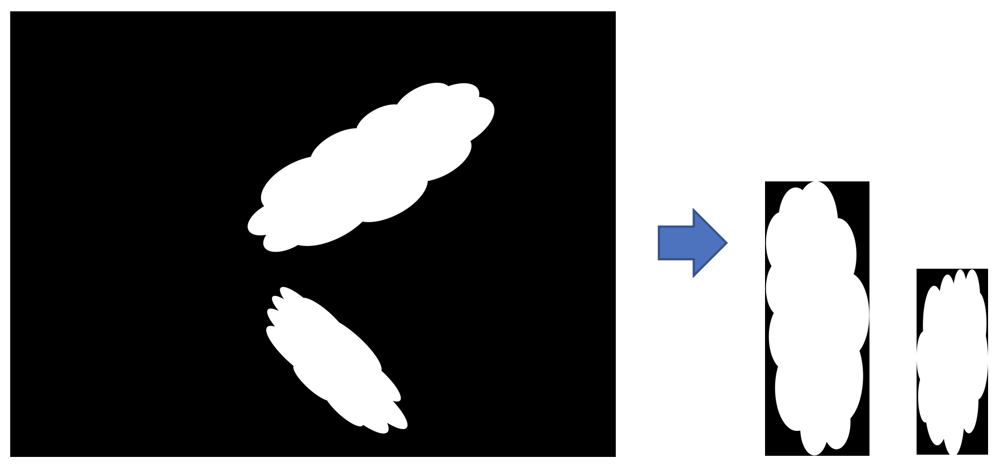

# segment_masks
Uses open CV to parse image and find masks, extract and save masks.

The task is to extract N rectangular images as shown on the picture below. 
Find N images and cropped output is always vertical. 




## Installation
Developed on Python 3.10.6.

`pip install -r requirements.txt`

## Usage
```
Usage: segment_masks.py [OPTIONS]

Options:
  --input-dir PATH   specify path to input directory that contains images
  --output-dir PATH  specify path to output directory
  --help             Show this message and exit.
```

Test run:
`python segment_masks.py`

Without arguments, it uses `testing_images` as input directory and `output_images` as output directory. 
